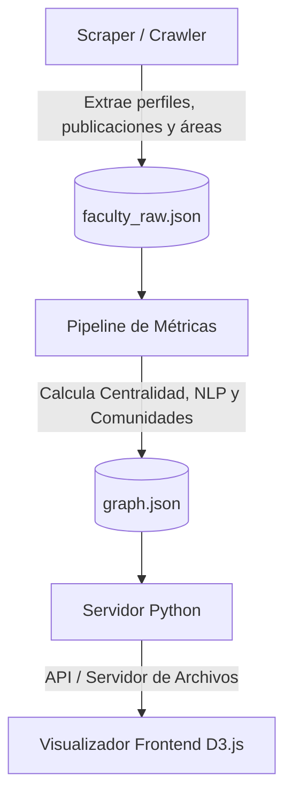

# UTEC·NetMap — Red de Colaboración Científica

**UTEC·NetMap** es una plataforma interactiva de análisis de redes y visualización de datos diseñada para explorar, diagnosticar y potenciar la colaboración científica entre los docentes y científicos de la Universidad de Ingeniería y Tecnología (UTEC).

A través de métricas avanzadas de grafos (Network Science) y Procesamiento de Lenguaje Natural (NLP), la herramienta revela la estructura de coautorías de la universidad, detecta comunidades interdisciplinares y predice nuevas oportunidades de sinergia académica.

---

## Cómo Ejecutar el Proyecto

Sigue estos pasos para instalar las dependencias, procesar la red de datos e iniciar el servidor local:

### 1. Requisitos Previos
Asegúrate de tener instalado **Python 3.8 o superior**.

### 2. Instalar Dependencias
Instala los paquetes necesarios definidos en `requirements.txt`:
```bash
pip install -r requirements.txt
```

### 3. Procesar los Datos del Grafo (Pipeline)
Ejecuta el script de métricas. Este procesa la base de datos de docentes extraída del portal CRIS, computa las distancias de red, calcula centralidades, detecta las comunidades y exporta la red unificada en `data/graph.json`:
```bash
python pipeline/metrics.py
```
*(Opcional: Si deseas recolectar datos actualizados desde el portal académico, puedes ejecutar `python crawler/scraper.py` antes de correr el pipeline).*

### 4. Iniciar el Servidor Web
Ejecuta el servidor HTTP incorporado en Python para servir el frontend y los endpoints de datos:
```bash
python server.py
```

### 5. Abrir la Aplicación
Abre tu navegador de preferencia e ingresa a la siguiente dirección:
```text
http://127.0.0.1:8000/
```

---

## Cómo Funciona el Proyecto (Arquitectura)

El proyecto se divide en tres componentes modulares:



1. **Extractor de Datos (`crawler/scraper.py`)**:
   Un crawler automatizado de alto rendimiento que realiza web scraping sobre el portal de investigación CRIS de la UTEC. Extrae perfiles académicos, fotografías, resúmenes biográficos, publicaciones e índices bibliométricos (h-index, publicaciones y citas).
2. **Procesador de Redes (`pipeline/metrics.py`)**:
   Utiliza librerías científicas de Python para enriquecer la red:
   *   **NetworkX**: Construye el grafo de coautorías y calcula coeficientes estructurales (Grado, Intermediación, PageRank y similitud de vecindario de Adamic-Adar).
   *   **Scikit-Learn (NLP)**: Aplica vectorización TF-IDF sobre el texto consolidado de áreas de investigación y biografías para calcular matrices de similitud de coseno, identificando investigadores con intereses afines.
3. **Visualizador Interactivo (`static/`)**:
   Un frontend premium construido sobre HTML5, CSS3 vanilla (con efectos de desenfoque de fondo "glassmorphism" y animaciones micro-interactivas) y **D3.js (v7)**. Utiliza simulaciones de fuerzas físicas para renderizar la red de forma dinámica y fluida.

---

## Qué se Muestra en Pantalla (Interfaz y Vistas)

La interfaz se divide en un área de visualización dominante y un panel lateral deslizable de análisis:

### Barras de Herramientas y Modos de Visualización:
*   **Default (🌐)**: Muestra la estructura de la red de coautoría orgánica.
*   **Degree (🎯)**: Escala la opacidad de los nodos según su centralidad de grado (quiénes tienen más colaboradores directos).
*   **Betweenness (🌉)**: Resalta con anillos naranjas a los docentes con mayor centralidad de intermediación, quienes actúan como puentes entre distintas áreas.
*   **Cluster (🫧)**: Agrupa los nodos alrededor del centroide de su departamento académico mediante fuerzas dirigidas y traza burbujas de fondo identificadas con el código de departamento.
*   **Communities (👥)**: Colorea los nodos utilizando la paleta de colores de Tableau basada en la detección de comunidades (Newman-Girvan).
*   **Similarity (🧠)**: Cambia las conexiones activas por enlaces punteados morados que representan a los pares con alta similitud de temas de investigación según NLP (TF-IDF), filtrando aquellos que ya tienen coautorías.
*   **H-Index Flow (📶)** *(Layout de Cuadrícula Ordenada)*:
    *   **Vista Estándar**: Alinea a todos los docentes de la universidad en una cuadrícula rectangular estricta, ordenados de forma descendente (de izquierda a derecha y de arriba a abajo) según su índice H (`h-index`). Las fuerzas físicas de atracción se desactivan por completo para asegurar un ordenamiento impecable.
    *   **Vista Combinada con Cluster**: Cuando se activa H-Index Flow junto con **Cluster**, los docentes se agrupan en cuadrículas locales ordenadas por H-index descendente alrededor del centroide de su respectivo departamento académico.

### Paneles de Inspección y Análisis:
*   **Filtro por Leyenda**: Permite aislar departamentos específicos haciendo clic en los tags interactivos del pie de pantalla.
*   **Buscador en Tiempo Real**: Resalta al docente buscado y enfoca automáticamente la cámara sobre su posición en el grafo.
*   **Ficha Detallada del Docente**: Al hacer clic en un nodo, se desliza un panel flotante desde la derecha que muestra su fotografía, métricas clave (publicaciones, citas, h-index), biografía, nube de áreas de investigación y listas interactivas de coautores y vecinos semánticos afines.
*   **Dashboard de Análisis**: Un entorno completo que contiene:
    *   **Degree & Bridges**: Rankings interactivos de los líderes y conectores principales.
    *   **Depts (Chord Diagram)**: Un diagrama de cuerdas interactivo que visualiza el flujo y cantidad de publicaciones cruzadas entre los distintos departamentos.
    *   **NLP & Predict**: Enlaces recomendados basados en similitud textual de keywords y modelos matemáticos de vecindad compartida.

---

## Preguntas Académicas y Tareas que Resuelve

NetMap no es solo un mapa visual; permite a los directores académicos, investigadores y estudiantes responder preguntas clave sobre el ecosistema de investigación de la UTEC:

1. **¿Quiénes lideran la investigación y la colaboración?**
   *   *Cómo responderlo*: Revisa la pestaña **Degree** en el panel lateral de análisis. Listará los profesores ordenados por cantidad absoluta de colaboradores, permitiendo ubicar rápidamente los núcleos de investigación más conectados.
2. **¿Quiénes actúan como "puentes" multidisciplinares?**
   *   *Cómo responderlo*: Activa la vista de **Betweenness** en el menú superior o lee la pestaña **Bridges** del panel. Los investigadores con anillos naranjas brillantes (alto valor de intermediación) actúan como puentes, conectando clústeres científicos distantes y previniendo la desconexión de red.
3. **¿La universidad investiga en "silos" departamentales o existe flujo integrado?**
   *   *Cómo responderlo*: Activa la vista **Cluster** para ver las fuerzas departamentales. Luego, abre la pestaña **Depts** en el panel de análisis para interactuar con el **Diagrama de Cuerdas (Chord Diagram)**: al pasar el cursor sobre los acordes del diagrama, verás el volumen exacto de publicaciones compartidas entre departamentos específicos (ej. cuántos artículos firman juntos Ciencia de la Computación e Bioingeniería), revelando la presencia de silos o integraciones directas.
4. **¿Cuáles son los temas científicos que generan mayor colaboración cruzada?**
   *   *Cómo responderlo*: Dirígete a la pestaña **Areas** del panel de análisis. Allí verás el ranking y frecuencia de palabras clave compartidas de forma interdepartamental en publicaciones coautoradas (por ejemplo: "machine learning", "water resources"), identificando qué áreas del saber traccionan la interdisciplinariedad.
5. **¿Qué oportunidades de colaboración futura e interdisciplinar existen (Predicción)?**
   *   *Cómo responderlo*: Ve a la pestaña **Predict** del panel de análisis. La herramienta aplica el índice matemático de **Adamic-Adar** sobre los vecinos comunes en la red para sugerir investigadores que, aunque no han publicado juntos aún, tienen una alta probabilidad de entablar sinergias exitosas debido a su cercanía estructural.
6. **¿Qué investigadores trabajan en temas similares y podrían postular a fondos compartidos sin saberlo?**
   *   *Cómo responderlo*: Activa la vista **Similarity** en el menú superior o abre la pestaña **NLP** del panel. La herramienta analiza con inteligencia semántica (TF-IDF y similitud de coseno) el texto de sus biografías y líneas declaradas para conectar de forma directa a investigadores con intereses afines pero sin coautorías previas.
7. **¿Quiénes tienen el mayor impacto bibliométrico e H-index y cómo se distribuyen?**
   *   *Cómo responderlo*: Activa el botón de **H-Index Flow**. El grafo se transformará en una cuadrícula rígida ordenada descendentemente por H-index, permitiéndote auditar visualmente los rangos del profesorado senior y junior a nivel global o clasificados de forma local por departamento si añades el botón **Cluster**.
8. **¿Cómo se agrupan los docentes de forma orgánica más allá de los departamentos formales?**
   *   *Cómo responderlo*: Activa la vista **Communities** en la barra superior. Verás la red coloreada de forma modular mediante el algoritmo Newman-Girvan. Además, la leyenda interactiva del pie de pantalla se actualizará mostrando los tags de palabras clave representativas calculadas para cada comunidad (ej. "control · robotics · automation"), permitiéndote filtrar el grafo por grupos afines reales.
